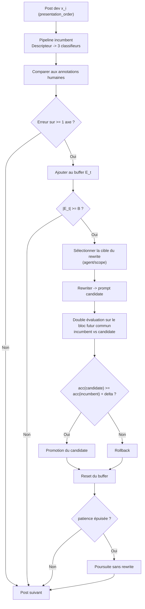

# Architecture

## Pipeline multi-agents

Chaque post passe par un pipeline en deux étapes : un **descripteur** multimodal extrait les features visuelles, puis 3 **classifieurs** text-only prédisent en parallèle.

```
Post → Router → détecte le type (FEED/REELS)
                 ↓
         Descripteur (multimodal)
         Reçoit : médias + caption + critères discriminants Δ^m
         Retourne : JSON structuré (features + résumé visuel libre)
                 ↓ features JSON + caption brute
         ┌───────┼───────┐
         ↓       ↓       ↓
    Agent       Agent    Agent
   catégorie  visual_f  stratégie
   (text-only, scopé, enum fermé)
```

### Pourquoi deux étapes ?

1. **Coût** : les tokens image/vidéo sont payés 1 seule fois (descripteur), pas 3× (un par axe)
2. **Traçabilité** : le JSON intermédiaire est loggable — on sait ce que le modèle "voit"
3. **Spécialisation** : le descripteur fait de la perception, les classifieurs font du jugement
4. **Feature extraction guidée** : le descripteur connaît les critères discriminants (Δ^m) et extrait ce qui compte

### Agents

1. **Router** : routage **déterministe** basé sur `media_product_type` (métadonnée structurée Instagram, pas de LLM). Dispatche vers le scope FEED ou REELS. Les STORY sont ignorés pour l'instant (0 dans le test).

2. **Descripteur** (multimodal) : reçoit les médias (toutes les slides carousel, vidéo, audio pour les reels) + la caption + les critères discriminants du scope. Retourne un JSON structuré de features visuelles + un résumé libre insightful. **Son prompt est optimisable par HILPO.**

3. **Agent catégorie** (text-only) : classifie parmi les 15 catégories éditoriales. Reçoit le JSON de features + la caption brute + les descriptions des 15 catégories.

4. **Agent visual_format** (text-only) : classifie parmi le sous-ensemble de formats visuels **scopé par type** :
   - FEED → `post_*` (44 formats)
   - REELS → `reel_*` (16 formats)

5. **Agent stratégie** (text-only) : détermine Organic vs Brand Content. Reçoit le JSON de features + la caption brute.

### Modèles via OpenRouter

| Rôle | Scope | Modèle | Modalités | Prix input/1M | Prix output/1M |
|------|-------|--------|-----------|---------------|----------------|
| Descripteur | FEED | Gemini 3 Flash Preview | image + vidéo + texte | $0.50 | $3.00 |
| Descripteur | REELS | Gemini 3 Flash Preview | image + vidéo + audio + texte | $0.50 | $3.00 |
| Classifieurs (×3) | tous | Qwen 3.5 Flash | texte seul | $0.065 | $0.065 |

**Choix du descripteur** : Gemini 3 Flash Preview pour les deux scopes (commit `7e352ab`, 2026-04-06). Validation empirique :
- Carousels jusqu'à 20 slides (max Instagram actuel) : ✓
- Vidéos REELS via URL GCS signée : ✓
- Détection audio (voix off, interview, musique) : ✓
- Stabilité sous concurrence (10 parallèles, 2 vagues) : 18/18 ✓

Alternatives écartées : **Qwen 3.5 Flash** (limite carousel à ~8 images, raw vide à 10+), **Gemini 2.5 Flash via Google AI Studio** (réponses vides + 503 *high demand* sous concurrence). Coût ~27× plus élevé que Qwen mais ~$50-130 sur tout le projet, acceptable pour la fiabilité.

#### Mécanisme d'output structuré

Le descripteur et les classifieurs n'utilisent **pas** la même feature OpenRouter pour contraindre leur sortie :

- **Descripteur** (Gemini 3 Flash Preview) : `response_format=json_schema` (strict). L'output est un objet complexe avec ~25 champs (booléens, strings, listes), aucun enum binaire — Gemini honore correctement le schema dans ce cas.
- **Classifieurs (×3)** (Qwen 3.5 Flash text-only) : **tool calling** via `tools=[tool] + tool_choice="auto"`. L'output est forcé à un objet `{label, confidence}` où `label` est un enum fermé scopé. Tool calling est utilisé plutôt que `response_format=json_schema` parce que les providers Qwen 3.5 Flash sur OpenRouter n'honorent pas réellement json_schema sur les enums binaires (ils renvoient un float `-1.5` au lieu d'un objet). Tool calling est universellement supporté par tous les providers OpenRouter, c'est l'approche éprouvée pour les classifications à enum fermé.

### Schema du descripteur

Le descripteur retourne un JSON structuré avec deux niveaux :
- **`resume_visuel`** : description libre et insightful de tous les médias
- **Features structurées** : champs typés pour réduire le champ de décision des classifieurs

```json
{
  "resume_visuel": "Texte libre décrivant ce qu'on voit, les patterns, les indices subtils",

  "texte_overlay": {
    "present": false,
    "type": null,
    "contenu_resume": null
  },
  "logos": {
    "views": false,
    "specifique": null,
    "marque_partenaire": null
  },
  "mise_en_page": {
    "fond": null,
    "nombre_slides": 1,
    "structure": null
  },
  "contenu_principal": {
    "personnes_visibles": false,
    "type_personne": null,
    "screenshots_film": false,
    "pochettes_album": false,
    "zoom_objet": false,
    "photos_evenement": false
  },
  "audio_video": {
    "voix_off_narrative": false,
    "interview_face_camera": false,
    "musique_dominante": false,
    "type_montage": null
  },
  "analyse_caption": {
    "longueur": 0,
    "mentions_marques": [],
    "hashtags_format": null,
    "mention_partenariat": false,
    "sujet_resume": null
  }
}
```

#### Valeurs possibles (enums)

| Champ | Valeurs |
|-------|---------|
| `texte_overlay.type` | `actualite`, `citation`, `chiffre`, `titre_editorial`, `liste_numerotee`, `annotation`, `description_produit` |
| `logos.specifique` | `BLUEPRINT`, `MOODY_MONDAY`, `MOODY_SUNDAY`, `REWIND`, `9_PIECES`, `THROWBACK`, `VIEWS_ESSENTIALS`, `VIEWS_RESEARCH`, `VIEWS_TV` |
| `mise_en_page.fond` | `photo_plein_cadre`, `couleur_unie`, `texture`, `collage`, `split_screen` |
| `mise_en_page.structure` | `slide_unique`, `gabarit_repete`, `opener_contenu_closer`, `collage_grille` |
| `contenu_principal.type_personne` | `artiste`, `athlete`, `personnalite`, `anonyme` |
| `audio_video.type_montage` | `captation_live`, `montage_edite`, `face_camera`, `b_roll_narration` |

### Routage et réduction de l'espace de labels

Le routage déterministe réduit l'espace de classification pour `visual_format` :

| Scope | Formats possibles | Réduction |
|-------|------------------|-----------|
| FEED | 44 formats `post_*` | — |
| REELS | 16 formats `reel_*` | ÷3 |

Chaque classifieur ne voit que les labels de son scope via un **tool use avec enum fermé**. Le modèle est contraint structurellement — il ne peut pas retourner un label hors taxonomie.

### Prompts scopés et optimisables

Chaque agent a un prompt composé de deux blocs :

```
┌─────────────────────────────────────────┐
│ Descriptions taxonomiques Δ^m (FIXES)   │
│ Rédigées par l'humain, scopées par type │
│ Cache-friendly (ne changent jamais)     │
├─────────────────────────────────────────┤
│ Instructions I_t (OPTIMISÉES par HILPO) │
│ Modifiées par le rewriter à chaque      │
│ itération de la boucle                  │
└─────────────────────────────────────────┘
```

6 prompts optimisables au total :

| Prompt | Agent | Scope |
|--------|-------|-------|
| `I_t^(desc, FEED)` | Descripteur | FEED |
| `I_t^(desc, REELS)` | Descripteur | REELS |
| `I_t^(cat)` | Classifieur catégorie | tous |
| `I_t^(vf, FEED)` | Classifieur visual_format | FEED |
| `I_t^(vf, REELS)` | Classifieur visual_format | REELS |
| `I_t^(str)` | Classifieur stratégie | tous |

### Flux d'annotation et simulation (Phase 3)

L'annotation et l'optimisation sont **découplées** :

1. **Annotation** : l'humain annote tous les posts dev via l'interface de swipe (rapide, pas d'attente modèle)
2. **Simulation** : un script rejoue les annotations dans l'ordre de présentation (seed=42) et simule la boucle HILPO

Sous les hypothèses du protocole, ce découplage est opérationnellement équivalent au live car :
- Les annotations sont déterministes (déjà faites)
- L'ordre de présentation est fixé (seed=42)
- Le modèle est suffisamment stable pour que les variations stochastiques restent limitées (temperature=0.1)
- Le prompt évolue de la même façon

**Avantage** : les ablations sont triviales — on rejoue la simulation avec B=1, 10, 30, 50 sans ré-annoter.

### Boucle HILPO (simulation prequential)

Le script de simulation parcourt les posts dev dans l'ordre de présentation. Le protocole est du type **prequential / progressive validation** : chaque bloc sert à évaluer avant de servir à optimiser.

#### Paramètres (fixés à l'avance)

| Paramètre | Valeur | Description |
|-----------|--------|-------------|
| `B` | 30 | Nombre d'erreurs avant trigger rewriter |
| `delta` | 2% | Gain minimum pour promotion |
| `patience` | 3 | Nombre de rewrites sans amélioration avant arrêt |
| `eval_window` | 30 | Taille du bloc d'évaluation post-rewrite |

#### Flux

1. Classer les posts un par un avec le prompt **incumbent** (actif)
2. Comparer chaque prédiction à l'annotation humaine
3. Si erreur : ajoutée au buffer
4. Si |buffer| >= B : le rewriter se déclenche
   - Il reçoit l'incumbent + le batch d'erreurs (features, descriptions, attendu vs observé)
   - Il propose un **candidate**
5. **Double évaluation** sur le bloc suivant (30 posts) :
   - Classer les 30 posts avec l'**incumbent**
   - Classer les 30 posts avec le **candidate**
   - Comparer les match rates sur les **mêmes posts**
6. Si accuracy(candidate) >= accuracy(incumbent) + delta : **promotion**
   Sinon : **rollback**
7. Reset du buffer d'erreurs, le cycle recommence
8. **Arrêt** si `patience` rewrites consécutifs sans promotion, ou fin des posts dev

#### Diagramme de flux



#### Nombre de rewrites estimé (basé sur B0)

| Axe | Taux d'erreur B0 | Rewrites estimés (1563 posts) |
|-----|-------------------|-------------------------------|
| visual_format | ~36% | ~19 |
| catégorie | ~13% | ~6 |
| stratégie | ~6.5% | ~3 |

Note : le rewriter peut optimiser le prompt du descripteur ET des classifieurs (2 niveaux d'optimisation).

#### Arbitrages du protocole

- **Fenêtre d'évaluation consommée** : les `eval_window` posts qui suivent un rewrite servent uniquement à comparer incumbent et candidate. Ils contribuent aux métriques de simulation, mais ne réalimentent pas le buffer d'erreurs. Avec `eval_window=30`, une quinzaine de rewrites consomme une part substantielle du split dev en évaluation passive plutôt qu'en apprentissage.
- **Patience globale** : le compteur de `patience` est global à la simulation, pas par cible. Trois rewrites consécutifs sans promotion, même sur des cibles différentes, arrêtent toute nouvelle tentative de rewrite.
- **Sélection de cible biaisée vers les axes dominants** : `pick_rewrite_target` favorise mécaniquement l'agent avec le plus d'erreurs observées. En pratique, `visual_format` sera plus souvent ciblé que `strategy`. Le descripteur n'est ciblé que lorsqu'un même post produit plusieurs erreurs downstream, ce qui sert de proxy pour un problème amont mais ne garantit pas qu'un prompt descripteur sera réécrit sur tous les runs.
- **Contexte rewriter asymétrique** : quand la cible du rewrite est un classifieur, le rewriter reçoit les descriptions taxonomiques de cet axe uniquement. Quand la cible est le **descripteur**, il reçoit les 3 jeux de descriptions (formats visuels + catégories + stratégies), car le descripteur extrait des features consommées par les 3 classifieurs en aval.
- **Promotion atomique** : le changement de prompt actif (`retire` ancien + `activate` nouveau) se fait dans une seule transaction (`promote_prompt` avec `conn.transaction()`), ce qui évite un état transitoire sans prompt actif en cas de crash.

### Évaluation

**Pendant la simulation (dev)** : chaque post est classifié avec le prompt actif à ce moment de la simulation. Le match est calculé automatiquement. La courbe de convergence se dessine en rolling window (fenêtre de 50 posts). Les moments de rewrite (v0 -> v1 -> v2...) sont annotés sur la courbe.

**Évaluation finale (test)** : le prompt vN (dernier prompt actif après convergence) est évalué une seule fois sur les 437 posts test via le même script que le B0. Comparé au B0 (prompt v0 sur le même test set).

### Limites à documenter dans le mémoire

- **Dépendance au chemin** : l'ordre de présentation (seed=42) influence quels posts tombent dans quel batch. Un autre seed donnerait une trajectoire différente.
- **Variance** : un seul run, pas de moyenne sur 5 splits (contrainte de coût API). À compenser par les ablations.
- **Pas de validation fixe** : pas de dev_val séparé. La séparation temporelle (prequential) joue ce rôle. Le test reste strictement non utilisé avant l'évaluation finale.
- **Prequential, pas iid** : le protocole assume un ordre séquentiel, pas un échantillonnage iid. À présenter comme tel.

## Séparation backend / engine

```
hilpo/              ← package Python : moteur HILPO
├── config.py       ← OpenRouter API key, model IDs
├── client.py       ← client OpenRouter (compatible OpenAI SDK)
├── router.py       ← routage déterministe FEED/REELS
├── schemas.py      ← DescriptorFeatures (Pydantic), PostPrediction
├── agent.py        ← descripteur multimodal + classifieurs tool use
├── inference.py    ← pipeline sync : router → descripteur → 3 classifieurs → stockage
├── async_inference.py ← pipeline async batch (semaphore, retry, concurrence)
├── db.py           ← accès BDD (taxonomie, posts, prompts, prédictions, api_calls)
├── gcs.py          ← signature URLs GCS (V4 Signed URLs, IAM Sign Blob)
├── errors.py       ← exceptions métier (LLMCallError)
├── rewriter.py     ← agent rewriter (ErrorCase, RewriteResult, appel LLM)
└── eval.py         ← métriques (accuracy, rolling, F1 macro, confusion)

apps/backend/       ← FastAPI : couche HTTP pour l'interface d'annotation
```

- Le **backend** gère les annotations humaines, le CRUD taxonomie, le serving des posts.
- Le **package `hilpo/`** contient toute la logique IA : descripteur, classifieurs, rewriter, boucle d'optimisation, évaluation.
- Le backend peut importer `hilpo` pour exposer des endpoints, mais la logique métier vit dans le package.
- Le package `hilpo/` est utilisable indépendamment (scripts, simulations, éval CLI).
- **Prompts v0** : il n'y a plus de module `hilpo/prompts_v0.py`. Les 6 prompts initiaux sont seedés en BDD via la migration SQL [`006_seed_prompts_v0.sql`](../apps/backend/migrations/006_seed_prompts_v0.sql) et chargés dynamiquement par `run_simulation.py` via `get_active_prompt(conn, agent, scope)`. La BDD est la source de vérité unique, lockée via git (toute modification nécessite une nouvelle migration). Référence humaine miroir : [`docs/prompts_v0.md`](./prompts_v0.md).

### Contraintes de séparation des données

| Split | Modèle prédit ? | Prompt optimisé dessus ? |
|-------|-----------------|--------------------------|
| **dev** (1 563) | ✅ oui | ✅ oui — les erreurs nourrissent le rewriter |
| **test** (437) | ❌ pas pendant l'optimisation | ❌ jamais — évaluation finale uniquement |

L'humain annote **en aveugle** (sans voir la prédiction du modèle) pour éviter le biais.

## Formalisation mathématique

### Notation

- **D** = {(x_i, m_i)} pour i=1..N : ensemble de posts, où x_i = (image_i, caption_i) est l'entrée multimodale et m_i ∈ {FEED, REELS} le type
- **Y_k^m** : espace des labels pour l'axe k ∈ {catégorie, visual_format, stratégie}, scopé par le type m. Pour visual_format : Y_vf^FEED = {post_*}, Y_vf^REELS = {reel_*}. Pour catégorie et stratégie : identique quel que soit m.
- **Δ^m** : descriptions taxonomiques scopées par type m (rédigées par l'humain, fixes). Pour visual_format, seules les descriptions des formats du scope m sont injectées dans le prompt.
- **I_t^(k,m)** : instructions actives à l'itération t pour l'agent k scopé au type m. C'est la partie optimisée par HILPO.
- **p_t = (I_t, Δ^m)** : prompt complet = instructions + descriptions scopées. Seul I_t change au fil des itérations.
- **f_θ(x, p)** : modèle de vision-langage (paramètres θ fixés), prompt p
- **h(x_i) ∈ Y_k** : annotation humaine pour le post x_i
- **D(x_i, p_desc)** : sortie du descripteur — features JSON extraites du post x_i avec le prompt p_desc

### Algorithme (simulation post-annotation)

L'humain annote d'abord tous les posts dev. La simulation rejoue ensuite les annotations dans l'ordre de présentation et optimise le prompt.

```
Entree : D_dev = {(x_i, h(x_i))} posts dev annotes (presentation_order)
         B (batch size = 30), f_theta, I_0 (instructions initiales), Delta (descriptions)
Sortie : I_T (instructions optimisees)

t = 0
E_t = {}                                  // buffer d'erreurs

Pour chaque post x_i dans l'ordre de presentation :
    1. features_i = D(x_i, (I_t^desc, Delta^m))    // descripteur multimodal
    2. Pour chaque axe k en parallele :
         y_hat_i^k = f_theta(features_i, caption_i, (I_t^k, Delta^m))
    3. Si h(x_i) != y_hat_i pour un axe k :
         E_t = E_t + {(x_i, features_i, h(x_i), y_hat_i)}
    4. Si |E_t| >= B :
         I_{t+1} = R(I_t, E_t, Delta)              // rewriter
         Evaluer I_{t+1} sur les 30 prochains posts (fenetre passive)
         Si acc(I_{t+1}) >= acc(I_t) :
             t = t + 1                              // promotion
         Sinon :
             rejeter I_{t+1}                        // rollback
         E_t = {}                                   // reset buffer
    5. Critere d'arret : variation accuracy < 2% sur 3 iterations -> STOP

Retourner I_t
```

Note : les annotations h(x_i) sont pré-existantes. La simulation est conçue pour reproduire le comportement du live dans notre protocole, l'humain annotant en aveugle (sans voir la prédiction du modèle).

### Propriétés à analyser

- **Convergence** : le prompt se stabilise-t-il ? Mesurable via la courbe accuracy vs nombre d'annotations — on s'attend à un plateau
- **Monotonicité** : le mécanisme de rollback garantit que la performance ne décroît pas (en théorie). À vérifier empiriquement via l'ablation A5 (sans rollback)
- **Efficacité en annotations** : combien d'annotations pour atteindre le plateau ? C'est le chiffre clé pour valider H1 (≤ 200 par axe)
